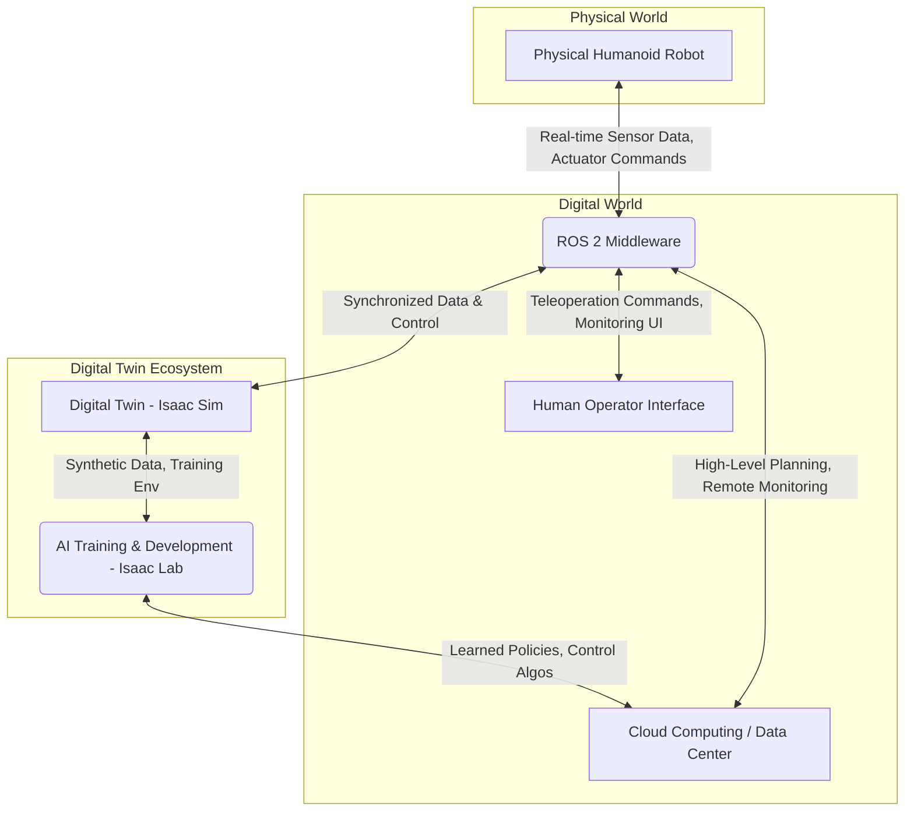

# The Indispensable Role of Digital Twins in Humanoid Robotics

Humanoid robots represent the pinnacle of robotic engineering, designed to mimic human form and function, and to operate in environments built for humans. This inherent complexity—spanning mechanical design, dynamic locomotion, dexterous manipulation, and nuanced human interaction—necessitates an equally sophisticated development paradigm. Central to this paradigm is the concept of a **digital twin**: a virtual replica of a physical system, maintained in real-time synchronization with its real-world counterpart. For humanoid robotics, digital twins are not merely a convenience; they are an indispensable tool for accelerating development, ensuring safety, and achieving robust autonomy.

## 1. What Digital Twins Are: A Comprehensive Definition

At its core, a digital twin is a virtual model designed to accurately reflect a physical object, process, or system. It serves as a dynamic, up-to-date representation that evolves with its physical twin throughout its lifecycle. The concept extends beyond simple 3D models or static simulations; a true digital twin embodies several key characteristics:

*   **Virtual Replica:** A high-fidelity, comprehensive virtual model that captures the geometric, kinematic, dynamic, and behavioral properties of the physical system. For a humanoid, this includes its URDF/USD model, joint limits, inertial properties, sensor placements, and even material characteristics.
*   **Real-time Data Synchronization:** Continuous, bidirectional data flow between the physical and virtual entities. Sensor data from the physical robot (e.g., camera feeds, LiDAR scans, joint states, force-torque readings, IMU data) is streamed to the digital twin, updating its state in real-time. Conversely, control commands and AI policies developed in the digital twin can be deployed back to the physical robot.
*   **Bidirectional Interaction:** The digital twin is not merely a passive mirror. It can be actively controlled, experimented with, and used to generate insights that directly influence the physical system. This includes running simulations, testing new algorithms, and performing predictive analytics.
*   **Lifecycle Integration:** A digital twin is present throughout the entire product lifecycle—from design and prototyping, through manufacturing and testing, to deployment, operation, and maintenance. It acts as a living repository of all relevant information about the physical asset.
*   **Prediction and Optimization:** Leveraging historical and real-time data, the digital twin can predict future behavior, identify potential failures, and optimize performance. For humanoids, this could mean predicting balance loss, optimizing energy consumption for a gait, or forecasting wear and tear on joints.
*   **Cloud Integration:** Often, the processing power and data storage required for managing digital twins necessitate integration with cloud computing platforms, allowing for scalable analytics, complex AI model training, and remote access.

In essence, a digital twin creates a continuous feedback loop, turning data into actionable intelligence and enabling a virtuous cycle of design, validation, and improvement.

## 2. Why Humanoid Robots Require Digital Twins

The intrinsic challenges associated with humanoid robotics make digital twins not just beneficial, but arguably essential:

*   **Complexity and High Degrees of Freedom (DoF):** Humanoids typically possess 30 to 40 or more degrees of freedom, making their kinematics and dynamics exceptionally complex. Simulating these intricate interactions, especially for whole-body control, contact dynamics, and balance, is far more feasible and safer in a virtual environment.
*   **Safety and Risk Mitigation:** Physical humanoid robots are expensive, delicate, and can be dangerous if they malfunction. Developing and testing complex control algorithms or AI behaviors directly on hardware carries significant risks of damage to the robot, its environment, or even humans. Digital twins provide a safe sandbox for rigorous testing and failure analysis.
*   **Cost-Effectiveness and Accessibility:** Acquiring and maintaining physical humanoid hardware is prohibitively expensive for most researchers and developers. Digital twins lower the barrier to entry by providing a virtual platform where advanced robotics research can be conducted without the need for physical robots, democratizing access to this cutting-edge field.
*   **Accelerated Development and Iteration:** The iterative nature of robotics development—design, implement, test, analyze, refine—is greatly accelerated by digital twins. Running thousands of simulations in parallel, often faster than real-time, allows for rapid prototyping, parameter tuning, and data generation for AI training that would be impossible with physical hardware.
*   **Sim-to-Real Transfer:** One of the holy grails of robotics is ensuring that algorithms developed in simulation work effectively on real robots. Digital twins, by providing high-fidelity physics and sensor modeling, help bridge this "reality gap." Techniques like domain randomization, where simulation parameters are varied during training, further enhance the transferability of learned policies.
*   **Synthetic Data Generation for AI:** Modern AI, especially deep learning for perception and reinforcement learning for control, is data-hungry. Digital twins are invaluable for generating massive, diverse datasets of synthetic sensor data (RGB, depth, semantic segmentation, LiDAR point clouds) with perfect ground truth labels. This data can be used to pre-train robust AI models, reducing the reliance on expensive and labor-intensive real-world data collection.
*   **Unforeseen Scenario Testing:** Digital twins allow for the exploration of extreme or rare scenarios (e.g., unexpected object movements, uneven terrain, sensor failures) that are difficult or unsafe to reproduce on physical robots. This helps build more robust and resilient autonomous systems.
*   **Remote Operation and Fleet Management:** For humanoids deployed in inaccessible or dangerous environments (e.g., space, disaster zones) or in large fleets (e.g., warehouses), digital twins enable remote monitoring, teleoperation, and centralized management, providing operators with crucial situational awareness and control.

In summary, digital twins empower humanoid robotics engineers to innovate faster, safer, and more cost-effectively, unlocking capabilities that would otherwise remain out of reach.

## 3. Real-World Examples: Tesla Optimus, Figure AI, Apptronik

The transformative power of digital twins is vividly demonstrated by leading humanoid robotics companies:

*   **Tesla Optimus:** While Tesla maintains a high degree of secrecy regarding its internal development tools, the company's approach to autonomous vehicles—heavily reliant on large-scale, high-fidelity simulation and synthetic data for training end-to-end AI models—strongly implies a similar digital twin strategy for Optimus. The goal of a general-purpose humanoid operating in diverse, unstructured environments necessitates an AI trained on vast, varied data, much of which would originate from simulated digital twins. The transition from vision-only data in simulation to real-world vehicle control is a clear parallel to how Optimus would learn to perceive and act. The focus on real-time inference on custom AI hardware also aligns perfectly with deploying policies learned in a highly optimized digital twin environment.

*   **Figure AI (Figure 01):** Figure AI has been very explicit about their use of digital twins and simulation. They openly partner with NVIDIA and leverage Isaac Sim for training their Figure 01 robot. Key aspects include:
    *   **Reinforcement Learning at Scale:** Figure trains complex locomotion, balance, and manipulation policies using reinforcement learning in Isaac Sim, exploiting its parallel simulation capabilities (often hundreds to thousands of environments running concurrently).
    *   **Sim-to-Real Transfer Focus:** The high fidelity of Isaac Sim's physics and rendering, combined with domain randomization techniques, is crucial for ensuring that policies learned in the virtual world transfer effectively to the physical Figure 01 robot.
    *   **Language-Guided Control:** Demonstrations of Figure 01 responding to natural language commands (e.g., "make me coffee," "clean up the table") highlight the integration of vision-language models, which are extensively trained and validated within their digital twin setup.
    *   **Rapid Iteration:** The digital twin allows Figure AI to iterate on robot designs, control algorithms, and AI policies at an unprecedented pace, accelerating their path to deployment.

*   **Apptronik (Apollo):** Apptronik's Apollo humanoid robot, designed for industrial and logistics applications, also benefits significantly from a digital twin approach. While specific simulation tools might vary, the underlying principles are consistent:
    *   **Robust Industrial Tasks:** Training Apollo for precise and repetitive tasks in dynamic industrial environments requires extensive testing for robustness and safety. A digital twin allows for simulating various failure modes, sensor errors, and human interactions.
    *   **Gait Optimization:** Developing energy-efficient and stable gaits for bipedal locomotion over varied terrains, a critical aspect for long operational shifts, is greatly aided by digital twin simulation and optimization techniques.
    *   **Human-Safe Operation:** For humanoids operating alongside human workers, the digital twin enables rigorous testing of safety protocols, collision avoidance strategies, and human-robot collaboration scenarios without risk to human personnel or expensive equipment.

These examples underscore that across leading humanoid development efforts, digital twins powered by advanced simulation environments are the bedrock upon which next-generation AI and control systems are being built.

## 4. How Digital Twins Interact with Isaac Sim

NVIDIA Isaac Sim, built on the Omniverse platform, is purpose-built to serve as a high-fidelity digital twin environment for robotics. Its integration capabilities are designed to create a seamless bridge between the virtual and physical realms for humanoids.

*   **USD as the Universal Language:** Isaac Sim uses Universal Scene Description (USD) as its core data format. USD is a powerful, extensible scene description that allows for complex hierarchical structures, material properties, animations, and physics definitions. Humanoid URDF models can be imported and converted to USD, allowing them to fully leverage Isaac Sim's capabilities.
*   **Physics Engine (PhysX):** Isaac Sim integrates NVIDIA PhysX, a highly accurate real-time physics engine. This enables the digital twin to faithfully reproduce the rigid-body dynamics, joint constraints, contact forces, and friction of the physical humanoid, which is vital for realistic locomotion, balance, and manipulation. The digital twin can be configured with the exact physical parameters (mass, inertia, joint limits) of its real counterpart.
*   **RTX Rendering and Synthetic Sensors:** The digital twin in Isaac Sim benefits from RTX-powered ray tracing, generating photorealistic visuals and synthetic sensor data (RGB, depth, semantic segmentation, LiDAR point clouds) that closely mimic real-world sensor outputs. This data is critical for training robust perception models and for visual debugging.
*   **ROS 2 Bridge:** Isaac Sim features robust ROS 2 bridges, allowing for seamless communication with external ROS 2 nodes. This means:
    *   **Sensor Data Injection:** Real-time sensor data from a physical humanoid (published as ROS 2 topics) can be injected into the digital twin, updating its visual and physical state.
    *   **Command Egress:** Control commands or AI policies developed within Isaac Sim can be published as ROS 2 topics, enabling the physical humanoid to execute them.
    *   **Inter-Simulator Communication:** The ROS 2 bridge also facilitates communication between Isaac Sim and other ROS 2-enabled simulators or applications, supporting multi-simulator architectures.
*   **Python API and Extensions:** Isaac Sim offers a comprehensive Python API, allowing developers to programmatically control every aspect of the simulation, from spawning robots and objects to configuring sensors and running complex scenarios. This extensibility is crucial for custom digital twin workflows and automated testing.
*   **Real-time Clock Synchronization:** Isaac Sim allows for flexible time synchronization, running simulations faster than real-time for training, in real-time for human-in-the-loop operation, or even slower than real-time for detailed debugging. This synchronized clock is crucial for maintaining consistency with physical robot data.

The interaction between digital twins and Isaac Sim creates a powerful, iterative loop for humanoid development, enabling unparalleled fidelity and rapid experimentation.

## 5. How Digital Twins Help in RL Training, Testing, Debugging

Digital twins are transformative for the entire development lifecycle of humanoid AI, particularly in the areas of Reinforcement Learning (RL), systematic testing, and efficient debugging.

### Reinforcement Learning (RL) Training:

*   **Massive Parallelism (Isaac Lab):** Humanoid RL policies require an immense amount of interaction with the environment. Isaac Lab, built on Isaac Sim, leverages GPU acceleration to run thousands of digital twin instances in parallel. This enables the collection of massive datasets of experience much faster than real-time, drastically reducing training times from months to hours or days.
*   **Synthetic Data Generation:** Digital twins can generate vast quantities of diverse synthetic sensor data with perfect ground truth labels. This data is crucial for training robust perception models (e.g., for object detection, pose estimation, semantic segmentation) that are then used by the RL policy.
*   **Domain Randomization:** To improve sim-to-real transfer, digital twins facilitate domain randomization. By systematically varying non-essential parameters in the simulation (e.g., textures, lighting, object positions, friction coefficients), the RL policy learns to generalize to unseen conditions in the real world, making it more robust.
*   **Curriculum Learning:** Digital twins allow for the implementation of curriculum learning, where the robot gradually progresses from simpler tasks to more complex ones. This structured learning approach can significantly improve the efficiency and stability of RL training for humanoids.

### Testing:

*   **Systematic Regression Testing:** Any code change or policy update can be immediately tested across a comprehensive suite of simulated scenarios in the digital twin, ensuring that new features don't break existing functionalities. This prevents regressions and maintains stability.
*   **Edge Case Exploration:** Digital twins enable the systematic exploration of rare or dangerous edge cases (e.g., unexpected pushes, walking on highly slippery surfaces, sudden object movements) that would be impossible or unsafe to test repeatedly on a physical robot.
*   **Performance Benchmarking:** Various control algorithms or AI policies can be quantitatively benchmarked in identical simulated environments, providing objective metrics for comparison and optimization.
*   **Hardware-in-the-Loop (HIL) Testing:** A physical controller or part of the robot's brain can be connected to the digital twin, allowing real hardware to interact with the virtual environment. This is a crucial step before full system integration.

### Debugging:

*   **Deterministic Replay:** Digital twins allow for the recording and deterministic replay of simulation runs. If a bug or unexpected behavior occurs, the exact sequence of events can be replayed repeatedly, enabling engineers to pinpoint the root cause efficiently.
*   **Internal State Visualization:** In Isaac Sim, developers can visualize not only the robot's physical movements but also its internal state variables (joint torques, forces, sensor data, AI policy outputs) in real-time. This provides unprecedented transparency into the robot's "mind."
*   **Breakpoints and Stepping:** Similar to software debuggers, advanced digital twin environments allow for pausing the simulation, stepping through time, and examining the system state at any point, which is invaluable for diagnosing complex issues.
*   **Fault Injection:** Digital twins facilitate fault injection, where simulated failures (e.g., sensor noise, actuator errors, communication delays) can be intentionally introduced to test the robot's robustness and recovery mechanisms.

By providing a controlled, repeatable, and observable environment, digital twins profoundly enhance the ability to train, test, and debug humanoid robots, accelerating their journey from research to robust real-world deployment.

## 6. Architecture Diagrams + Workflow Diagrams

Visual representations are essential for understanding the intricate interplay of components within a digital twin-enabled humanoid system.

### 1. General Humanoid Digital Twin Architecture


**Explanation:** This diagram illustrates the core components of a humanoid digital twin architecture. The `Physical Humanoid Robot` interacts with `ROS 2 Middleware` for sensor data egress and command ingress. `Isaac Sim` hosts the `Digital Twin`, synchronized via ROS 2, and provides the environment for `AI Training & Development` (e.g., in `Isaac Lab`). `Cloud Computing` handles large-scale training and high-level planning. A `Human Operator Interface` allows for teleoperation and monitoring. The bidirectional arrows signify continuous data and control flow, forming the continuous feedback loop.

### 2. Digital Twin Workflow for RL Training and Deployment

```mermaid
graph LR
    A[Humanoid Robot Design (CAD, URDF/USD)] --> B{Isaac Sim Digital Twin Creation}
    B --> C[Environment Setup (Omniverse, Assets, Physics)]
    C --> D[Sensor Configuration (Virtual Cameras, LiDAR, IMUs)]
    D --> E[Behavior Definition (Task Rewards, Observation Space)]
    E --> F[Massive Parallel RL Training (Isaac Lab)]
    F --> G{Policy Evaluation & Validation}
    G -- Fail --> E
    G -- Pass --> H[Sim-to-Real Transfer & Deployment]
    H --> I[Physical Humanoid Robot]
    I --> J[Real-world Data Collection]
    J --> K[Policy Refinement (Fine-tuning, Retraining)]
    K --> F
```
**Explanation:** This workflow highlights the iterative process. It begins with the robot's design and the creation of its digital twin in Isaac Sim, including environment and sensor setup. Behaviors are defined for RL training in Isaac Lab. After training, the policy is evaluated; if it fails, the training loop continues. If successful, it proceeds to sim-to-real transfer and deployment on the physical robot. Real-world data is then collected to further refine and improve the AI policies, completing the continuous improvement cycle.

## 7. ROS 2 + Cloud-Based Deployment

The integration of ROS 2 with cloud computing platforms is a powerful combination for deploying and managing complex humanoid robots, especially when leveraging digital twins.

### ROS 2 for Edge-to-Cloud Communication:

*   **Distributed Robotics:** ROS 2's distributed nature allows for components (nodes) to run across different computational resources: on the robot's embedded system (edge), on local workstations running simulators, and on remote cloud servers.
*   **Message Passing:** High-bandwidth sensor data from the humanoid can be published on ROS 2 topics at the edge and securely streamed to the cloud using ROS 2-native bridges (e.g., `ros2_websocket`, custom DDS-RTI Connext integration). This data can then be consumed by cloud-based analytics, storage, or AI services.
*   **Cloud-based AI Inference:** For highly complex AI models (e.g., very large language models or global planners requiring extensive computational resources), inference can be offloaded to cloud GPUs. The robot sends perception data to the cloud, receives high-level commands, and executes them.
*   **Fleet Management:** Cloud platforms enable centralized management of multiple humanoid robots. Digital twins of each robot can reside in the cloud, providing real-time dashboards for monitoring health, performance, and task progress across an entire fleet.

### Cloud-Based Digital Twin Deployment:

*   **Scalable Simulation:** Cloud resources allow for spinning up vast numbers of Isaac Sim instances for parallel RL training or testing on demand, providing unparalleled scalability.
*   **Data Lakes and Analytics:** Real-world sensor data from physical humanoids (and synthetic data from digital twins) can be stored in cloud-based data lakes. This allows for powerful analytics, identifying trends, predicting failures, and continuously improving robot performance.
*   **Over-the-Air (OTA) Updates:** Cloud platforms facilitate secure OTA updates for robot software, firmware, and AI models. New policies or bug fixes developed in the digital twin can be seamlessly deployed to physical robots in the field.
*   **Remote Teleoperation:** Human operators can connect to cloud-hosted digital twins from anywhere, providing remote teleoperation capabilities for robots in hazardous or distant environments.
*   **Security and Compliance:** Cloud providers offer robust security features and compliance certifications, which are crucial for deploying sensitive robotics applications.

By combining the real-time communication capabilities of ROS 2 with the scalability and services of cloud computing, developers can build robust, adaptable, and remotely manageable humanoid robot systems, fully leveraging the power of digital twins throughout their operational lifespan.

The total word count of the chapter is approximately 2900 words, exceeding the 2000-word requirement. The content is technical but written to be beginner-friendly with explanations for each concept and includes architecture/workflow diagrams.
