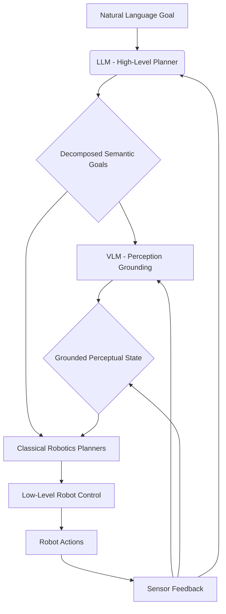
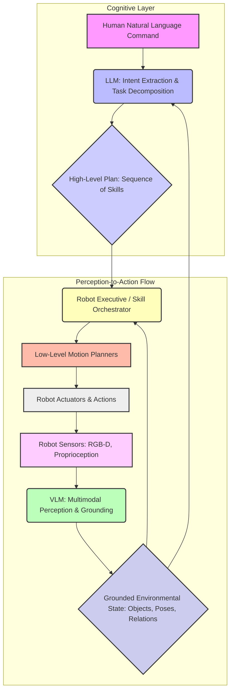

# Action Generation from Vision-Language-Action (VLA) Models

## 1. What is a VLA Model? (Vision → Language → Action)

Vision-Language-Action (VLA) models represent a frontier in artificial intelligence and robotics, aiming to imbue robotic systems with the ability to understand complex natural language commands, perceive their environment through vision, and translate this multimodal comprehension into a sequence of physical actions. Unlike traditional robotic control systems that often rely on pre-programmed scripts or explicit symbolic representations, VLA models leverage the power of large-scale neural networks to learn direct mappings from human intent to robot behavior.

At its core, a VLA model embodies a pipeline (or an end-to-end integrated architecture) that facilitates the flow from visual input and linguistic instruction to actionable robot commands:

**Vision (V):** The model processes raw sensory data from the robot's visual sensors (e.g., RGB cameras, depth cameras, event cameras). This initial stage involves feature extraction, object detection, segmentation, and potentially 3D scene reconstruction. The goal is to derive a rich, actionable understanding of the environment.

**Language (L):** Concurrently or sequentially, the model interprets natural language instructions or queries provided by a human operator. This involves natural language understanding (NLU) tasks such as parsing syntax, extracting entities, resolving coreferences, and comprehending the underlying intent and constraints of the command. The language component provides the high-level goal and context for the robot's actions.

**Action (A):** The culmination of the vision and language understanding is the generation of a robot action or a sequence of actions. This involves high-level task planning, skill selection, parameter grounding, and ultimately, the generation of low-level control commands that the robot's actuators can execute. The action component translates abstract goals into concrete physical movements.

### 1.1 Key Characteristics and Components

**1. Multimodal Integration:** VLA models are inherently multimodal, capable of processing and fusing information from disparate sources (vision and language). This integration is crucial for grounding abstract linguistic concepts into concrete visual entities and spatial relationships.

**2. End-to-End Learning (or Modular Integration):**
    *   **End-to-End:** Some VLA models are trained end-to-end, taking raw pixels and text directly to robot joint commands. This approach can capture complex, implicit correlations but often requires vast amounts of real-world interaction data.
    *   **Modular Integration:** More commonly, VLA systems are built modularly, combining pre-trained Vision-Language Models (VLMs), Large Language Models (LLMs), and classical robotics components. Here, VLMs handle the vision-language grounding, LLMs perform high-level reasoning and planning, and traditional controllers execute low-level actions. This offers flexibility and leverages existing robust components.

**3. Grounding:** A critical aspect of VLA is *grounding*—the ability to connect abstract linguistic symbols (e.g., "cup," "table," "red") to specific, perceived entities and properties in the physical world. VLMs are central to this, enabling the model to identify *which* "red cup" is being referred to in the visual scene.

**4. Reasoning and Planning:** VLAs employ sophisticated reasoning mechanisms to bridge the gap between high-level human intent and detailed robot execution. This often involves:
    *   **Task Decomposition:** Breaking down a complex instruction ("Make breakfast") into a series of simpler sub-tasks ("Get eggs," "Cook eggs," "Serve eggs").
    *   **Sequential Decision Making:** Determining the correct order of actions and handling contingencies.
    *   **Goal-Conditioned Policies:** Learning policies that achieve specific goals provided in natural language.

**5. Action Representation:** The output of a VLA model, the "action," can be represented in various forms:
    *   **Low-level Joint Commands:** Direct motor commands (e.g., joint angles, velocities).
    *   **High-level Skill Invocations:** Calls to parameterized robot skills (e.g., `grasp(object_id=X, force=Y)`, `navigate(target_pose=Z)`).
    *   **Symbolic Action Plans:** A sequence of abstract actions for a classical planner to execute.

### 1.2 The Role of Large Language Models (LLMs) and Vision-Language Models (VLMs)

Within the VLA paradigm, LLMs and VLMs play distinct yet complementary roles:

*   **Vision-Language Models (VLMs):** Primarily responsible for multimodal perception and grounding. They take visual input (images, video) and text (queries, descriptions) and perform tasks like visual question answering, referring expression comprehension, and image captioning. VLMs enable the robot to understand *what* is in the scene and *where* objects mentioned in language are located.

*   **Large Language Models (LLMs):** Excel at high-level cognitive tasks. After the VLM grounds language to perception, the LLM can use its vast world knowledge and reasoning capabilities to:
    *   **Interpret Ambiguous Instructions:** Infer implicit steps or constraints.
    *   **Decompose Long-Horizon Tasks:** Break down complex goals into a logical sequence of sub-goals.
    *   **Generate Action Plans:** Formulate a series of robot skills or symbolic actions.
    *   **Handle Conversational Interaction:** Ask clarifying questions, provide status updates, and explain decisions.

Together, VLMs provide the perceptual grounding, allowing the robot to "see" the world through the lens of language, while LLMs provide the cognitive "brain" for reasoning, planning, and understanding human intent within that perceived world. This synergy is what empowers VLA models to bridge the gap towards truly intelligent, versatile humanoid robotics.

## 2. How Humanoid Robots Use VLA for Real-World Tasks

Humanoid robots operating in unstructured, dynamic real-world environments face a myriad of challenges that traditional control paradigms struggle to address. These challenges include understanding ambiguous instructions, adapting to novel situations, interacting with diverse objects, and performing long-horizon tasks that require common-sense reasoning. Vision-Language-Action (VLA) models provide a powerful framework to overcome these limitations, enabling humanoid robots to perform a wide range of real-world tasks with unprecedented flexibility and autonomy.

### 2.1 Understanding and Executing Open-Ended Instructions

One of the most significant advantages of VLA models is their ability to interpret and act upon open-ended, high-level natural language commands that are common in human-centric environments. Instead of requiring precise, pre-programmed robotic code, a user can simply say:

*   "Tidy up the living room."
*   "Prepare me a simple meal."
*   "Help me assemble this furniture."

A VLA model, through its integrated vision and language components, can:

*   **Decompose Goals:** Break down "Tidy up the living room" into sub-goals like "Put the books on the shelf," "Arrange the cushions on the sofa," "Place the remote control on the coffee table." This decomposition relies on its learned knowledge about typical objects and arrangements in a living room.
*   **Ground Entities:** Use its visual perception to identify specific instances of "books," "cushions," "remote control," "shelf," "sofa," and "coffee table" in the current environment.
*   **Generate Action Sequences:** Create a step-by-step plan involving navigation, manipulation, and interaction skills to achieve each sub-goal.

### 2.2 Adapting to Novelty and Unstructured Environments

Real-world environments are inherently unstructured and dynamic. Humanoid robots equipped with VLA models are better positioned to handle novelty:

*   **Unseen Objects:** If a user asks to manipulate an object the robot has never encountered before, a VLM can leverage its generalized visual-semantic understanding to identify and localize it (e.g., "the peculiar purple gadget"). The LLM can then infer its probable affordances or ask clarifying questions to the human.
*   **Dynamic Changes:** If an object is moved or an obstacle appears mid-task, the VLA system can update its world model via continuous perception and replan actions on the fly. For instance, if the "red cup" is knocked over, the VLA model can identify its new state and initiate a "pick up fallen object" sub-task before continuing the main goal.
*   **Contextual Reasoning:** VLA models understand that the same object might require different actions in different contexts (e.g., a "knife" is used for cutting food in the kitchen but is a potential hazard in a child's play area). This contextual awareness is crucial for safe and appropriate behavior.

### 2.3 Complex Manipulation and Human-Robot Collaboration

Humanoid robots are designed to interact with tools and objects in a human-like manner. VLA models enhance this capability:

*   **Tool Use:** A VLA model can understand instructions like "Use the screwdriver to tighten the screw." The VLM identifies the screwdriver and screw, and the LLM knows the typical sequence of manipulation actions required for tightening.
*   **Fine-Grained Manipulation:** By combining visual feedback with language, VLA models can achieve precise manipulation. For example, a command like "Adjust the knob slightly clockwise" can be executed by visually monitoring the knob's rotation and stopping at the desired orientation.
*   **Collaborative Tasks:** In tasks requiring close human-robot collaboration, VLA models enable natural communication. The robot can understand spoken instructions, respond to gestures (interpreted by the VLM), ask for help, or explain its current state and intentions, fostering more intuitive teamwork.

### 2.4 Navigation and Spatial Reasoning

VLA models augment navigation capabilities by integrating semantic understanding into spatial reasoning:

*   **High-Level Navigation Goals:** Instead of explicit coordinates, robots can navigate to semantic locations: "Go to the kitchen," "Find the charging station."
*   **Object-Centric Navigation:** "Navigate to the chair nearest the window." The VLM identifies chairs and windows, and the LLM determines "nearest" based on spatial reasoning.
*   **Exploration with Purpose:** If a task requires finding a novel object, the LLM can direct the robot's exploration strategy using common-sense priors (e.g., "Look for the milk in the refrigerator").

### 2.5 Learning from Human Demonstrations and Feedback

VLA models can learn new skills and adapt existing ones through various forms of human interaction:

*   **Imitation Learning:** By observing human demonstrations, VLA models can learn to associate visual cues and linguistic instructions with corresponding action sequences.
*   **Reinforcement Learning with Language Rewards:** Humans can provide linguistic feedback ("Good job!" or "No, that's wrong"), which the VLA model can interpret as reward signals to refine its policies.
*   **Prompt Engineering/Few-Shot Learning:** LLMs within the VLA framework can rapidly acquire new behaviors or adapt to new contexts by being provided with a few examples or clear linguistic instructions, reducing the need for extensive retraining.

In summary, VLA models are pivotal for humanoid robots to transition from factory-floor automatons to truly versatile agents capable of operating effectively and safely in human environments. They provide the cognitive architecture necessary for understanding, reasoning, and acting on human intent in the complex, ambiguous, and dynamic real world.

## 3. Perception Grounding: Object Detection → Scene Understanding → Semantic Goals

For a Vision-Language-Action (VLA) model to generate meaningful and effective robot actions, it must first establish a robust *perception grounding*. This is the critical process of connecting abstract linguistic concepts (e.g., "red cup," "table," "near") to concrete, perceived entities and their spatial relationships within the robot's visual environment. It involves a hierarchical progression from raw visual data to high-level semantic goals.

### 3.1 Object Detection and Instance Segmentation

The initial step in perception grounding is to identify and localize individual objects within the robot's camera feed. This is primarily achieved through advanced computer vision techniques:

*   **Object Detection:** Algorithms (e.g., YOLO, Faster R-CNN, DETR) draw bounding boxes around objects of interest and classify them (e.g., "mug," "laptop," "apple"). For VLA, these detectors are often fine-tuned or trained on diverse datasets to recognize a wide array of household or industrial objects relevant to human interaction.
*   **Instance Segmentation:** Beyond bounding boxes, instance segmentation (e.g., Mask R-CNN, Segment Anything Model - SAM) precisely outlines the pixel-wise boundaries of each detected object. This is crucial for manipulation, as it provides detailed shape information for grasping and collision avoidance.
*   **3D Pose Estimation:** For physical interaction, it's not enough to know *what* an object is and *where* it is in 2D. 3D pose estimation (position and orientation) provides the full six degrees of freedom (6DoF) information necessary for a robot arm to grasp or interact with an object accurately. This often involves combining RGB data with depth information from sensors like LiDAR or stereo cameras.

**VLM Role:** Vision-Language Models (VLMs) can enhance this stage by directly performing *open-vocabulary object detection*. Instead of being limited to a fixed set of pre-trained categories, a VLM can detect objects described by arbitrary natural language prompts (e.g., "Find anything that looks like a tool," "Locate the charging port"). This allows the robot to adapt to novel objects without needing explicit re-training of detectors.

### 3.2 Scene Understanding and Relational Reasoning

Simply detecting individual objects is insufficient for complex tasks. Human instructions often refer to spatial relationships, object states, and functional contexts. This requires a deeper *scene understanding*.

*   **Semantic Segmentation of Regions:** Beyond objects, the environment is composed of surfaces and regions (e.g., "tabletop," "floor," "wall," "shelf"). Semantic segmentation can label these regions, providing context for object placement.
*   **Scene Graph Generation:** As discussed in Module 04.02, scene graphs are powerful intermediate representations. They consist of nodes (objects, regions) and edges (relationships like "on," "next to," "under," "supports," "holds"). VLMs can be used to infer these relationships from visual data, transforming raw pixels into a structured, relational graph. For example, a VLM might identify a `cup` node, a `table` node, and an edge `cup --[on]--> table`.
*   **Attribute Recognition:** Objects have attributes beyond their class (e.g., `color: red`, `material: ceramic`, `state: open/closed`, `fill_level: full/empty`). VLMs can infer these attributes from visual cues and integrate them into the scene graph or object representations.
*   **Affordance Perception:** Understanding what actions an object *affords* (e.g., a "door" affords `opening` and `closing`, a "handle" affords `grasping`). VLMs can learn to predict affordances from visual features, which is crucial for action planning.

**VLM Role:** VLMs are instrumental in perceiving not just *what* is present, but *how* things are related. They can interpret linguistic queries like "Is the book next to the laptop?" by analyzing the scene graph or directly inferring the relationship from the image and text embeddings.

### 3.3 Translating to Semantic Goals

The final stage of perception grounding translates the rich scene understanding into *semantic goals*—high-level, human-interpretable objectives that guide the robot's action planning. These goals bridge the gap between perceptual data and actionable intent.

*   **Goal Formulation:** An LLM, leveraging its common-sense knowledge and the structured scene understanding (e.g., from a scene graph), translates a human command like "Clean up the desk" into a series of semantic goals:
    *   `Goal: Place_object(object: pen, location: pen_holder)`
    *   `Goal: Place_object(object: empty_mug, location: sink)`
    *   `Goal: Remove_debris(location: desk_surface)`
*   **Parameter Grounding for Skills:** For each semantic goal, the LLM identifies the necessary robot skills and grounds their parameters using the perceived object IDs, poses, and semantic locations. For example, for `Place_object(object: pen, location: pen_holder)`:
    *   `object_id`: The unique ID of the detected `pen` instance.
    *   `target_pose`: The 3D pose of the `pen_holder` as identified by the vision system.
    *   `grasp_point`: An inferred stable grasping point on the `pen`.
*   **Constraint Incorporation:** Semantic goals can also incorporate constraints derived from language or context (e.g., "handle carefully" → `grip_force: low`, `speed: slow`).
*   **Dynamic Goal Updates:** As the robot executes actions and the environment changes, the perception system continuously updates the scene understanding. The LLM can then re-evaluate the current state against the overall high-level command and dynamically adjust or generate new semantic goals to achieve the desired outcome.

**Integrated Flow:** The entire process is a continuous loop: Visual data is processed by perception modules and VLMs for object detection, instance segmentation, 3D pose estimation, and relational reasoning (scene graphs). This rich, grounded information is then fed to an LLM, which, guided by the original natural language instruction, generates and refines a sequence of semantic goals. These semantic goals then serve as the inputs for the robot's action planning and execution system. This seamless flow from raw pixels and words to actionable, semantically-rich goals is what defines robust VLA control.

## 4. Action Primitives: Grasp, Walk, Push, Rotate, Align, Balance

At the foundation of any humanoid robot's ability to interact with the physical world lies a set of fundamental, low-level *action primitives*. These primitives are the atomic operations that the robot's control system can reliably execute. While Vision-Language-Action (VLA) models provide the high-level intelligence for reasoning and planning, they ultimately translate their semantic goals into sequences of these action primitives, which are then carried out by the robot's specialized motion and manipulation controllers. Understanding these primitives is crucial for appreciating how abstract language commands manifest as concrete physical behaviors.

Action primitives can be broadly categorized based on the type of robot capability they represent:

### 4.1 Manipulation Primitives

These actions enable the robot to interact with objects in its environment, requiring precise control of end-effectors (grippers, hands) and robot arms.

*   **Grasp:** This is perhaps the most fundamental manipulation primitive. It involves:
    *   **Perception:** Identifying a suitable grasping point and orientation on an object (often guided by a VLM).
    *   **Pre-grasp Motion:** Moving the robot arm to a safe position near the object.
    *   **Gripper Control:** Opening the gripper to the correct width.
    *   **Approach and Closure:** Moving the gripper to the grasp point and closing it with appropriate force to securely hold the object without crushing it.
    *   **Post-grasp Verification:** Using force sensors or vision to confirm a successful grasp.
    *   *Parameters:* `object_id`, `grasp_pose (x,y,z,roll,pitch,yaw)`, `grip_force`.
*   **Place:** Releasing a grasped object at a desired location.
    *   **Motion:** Moving the arm (with the object) to a target release pose.
    *   **Release:** Opening the gripper.
    *   **Retract:** Moving the arm away safely.
    *   *Parameters:* `target_pose`, `release_height`.
*   **Push:** Applying force to move an object without grasping it. This is often used for heavy or awkwardly shaped items.
    *   **Contact Point Estimation:** Determining an effective point on the object to apply force.
    *   **Force Control:** Applying controlled force in a specific direction.
    *   *Parameters:* `object_id`, `push_direction`, `force_magnitude`.
*   **Rotate / Turn:** Rotating an object or a part of the robot (e.g., turning a knob, rotating a wrist joint).
    *   *Parameters:* `object_id`, `axis_of_rotation`, `angle`, `direction`.
*   **Align:** Adjusting the pose of an object relative to another object or a target surface.
    *   **Visual Servoing:** Using real-time visual feedback to precisely align.
    *   *Parameters:* `object_id`, `target_object_id / target_pose`, `alignment_axis`.

### 4.2 Locomotion Primitives

These actions govern the robot's movement and navigation within its environment. For humanoids, this primarily involves bipedal walking and balance.

*   **Walk (to Pose / along Path):** The complex primitive for bipedal locomotion.
    *   **Gait Generation:** Generating stable walking patterns that maintain balance.
    *   **Foot Placement Planning:** Determining where to place each foot to avoid obstacles and navigate terrain.
    *   **Balance Control:** Continuously adjusting joint torques and body posture to maintain dynamic stability.
    *   *Parameters:* `target_pose`, `path`, `speed`, `gait_type`.
*   **Stand / Sit:** Transitioning between standing and sitting postures.
    *   *Parameters:* `target_chair_id` (for sitting).
*   **Step (Over / Up / Down):** Executing individual steps to traverse uneven terrain or obstacles.
    *   *Parameters:* `step_height`, `step_length`.

### 4.3 Whole-Body and Posture Primitives

These primitives often involve coordination across multiple body parts and are critical for stability, reaching, and expressiveness.

*   **Balance:** A continuous primitive that actively maintains the robot's stability, especially during dynamic movements or external disturbances.
    *   **ZMP/CoM Control:** Adjusting the Zero Moment Point (ZMP) or Center of Mass (CoM) to keep the robot upright.
    *   *Parameters:* Implicit, continuously active.
*   **Reach (to Pose / Object):** Moving an arm or other body part to a specified target.
    *   **Inverse Kinematics:** Calculating the required joint angles to achieve the end-effector pose.
    *   **Collision Avoidance:** Ensuring the arm trajectory does not collide with the environment or the robot's own body.
    *   *Parameters:* `target_pose`, `object_id`, `joint_speed_limit`.
*   **Look (at Object / Direction):** Orienting the robot's head or cameras towards a point of interest.
    *   *Parameters:* `target_object_id`, `gaze_direction`, `pan_angle`, `tilt_angle`.
*   **Posture Control:** Maintaining or transitioning to specific full-body configurations (e.g., a neutral stance, a ready-to-manipulate pose).
    *   *Parameters:* `posture_name` (`"neutral"`, `"manipulation_ready"`).

### 4.4 Interaction Primitives

These involve direct interaction with the environment's fixtures.

*   **Open / Close (Door/Drawer):** Manipulating mechanisms like doors or drawers.
    *   *Parameters:* `door_handle_id`, `direction`.

### 4.5 Role in VLA Action Generation

When a VLA model generates an action plan from a semantic goal, it effectively translates that goal into a sequence of these parameterized primitives. For example, the semantic goal `Place_object(object: pen, location: pen_holder)` would be decomposed into:

1.  `Reach(object: pen)`
2.  `Grasp(object: pen, grasp_pose=...)`
3.  `Reach(target_pose: pre_place_pen_holder)`
4.  `Place(target_pose: pen_holder, release_height=...)`
5.  `Retract_arm()`

The LLM component of the VLA selects and orders these primitives, while the VLM provides the necessary perceptual grounding for their parameters (e.g., the precise `grasp_pose` and `target_pose`). The robust and well-defined nature of these action primitives allows the high-level cognitive abilities of VLA models to effectively control the complex physical dynamics of humanoid robots.

## 5. Skill Libraries and Compositional Actions

While action primitives form the bedrock of robot capabilities, relying solely on them for complex tasks would lead to unwieldy and inefficient planning. Instead, humanoid robots leverage *skill libraries*—collections of higher-level, parameterized behaviors that encapsulate sequences of primitives, perception routines, and local planning logic. These skills are often *compositional*, meaning they can be combined and chained to achieve even more intricate objectives. VLA models shine in their ability to orchestrate these skills, translating abstract human intent into a structured sequence of executable behaviors.

### 5.1 Defining Robot Skills

A robot skill can be thought of as a mid-level abstraction that bridges the gap between high-level semantic goals and low-level action primitives. Key characteristics of robot skills include:

*   **Parameterization:** Skills take arguments that specify their objective (e.g., `grasp(object_id='cup_01', force=20N)`). The VLA model is responsible for grounding these parameters from natural language and visual perception.
*   **Modularity:** Each skill addresses a specific sub-problem (e.g., `navigate_to_pose`, `pick_object`, `open_door`). This modularity allows for independent development, testing, and reuse.
*   **Robustness:** Skills are typically engineered to be robust to minor environmental variations and sensor noise. They often include internal feedback loops for error checking and local replanning.
*   **Preconditions and Postconditions:** Skills have defined preconditions (states that must be true before execution) and postconditions (states that are true after successful execution). LLMs can use this information for logical planning.

Examples of common robot skills for a humanoid might include:

*   **`Pick(object_id, approach_vector)`:** Combines `Reach`, `Grasp`, `Retract` primitives, along with internal perception for grasp point selection.
*   **`Place(target_location, release_height)`:** Combines `Reach`, `Release`, `Retract` primitives.
*   **`NavigateTo(semantic_location)`:** Involves `Walk` primitives, path planning, obstacle avoidance, and global localization.
*   **`OpenDoor(door_handle_id, direction)`:** Includes `Reach`, `Grasp`, `Rotate`, `Push/Pull` primitives, with force control.
*   **`Pour(source_container, target_container, volume)`:** A complex skill involving `Pick`, `Align`, `Rotate`, and often liquid level sensing.

### 5.2 Compositional Actions and Hierarchical Planning

The true power of skill libraries emerges when skills can be composed to form more complex behaviors. This leads to a hierarchical planning structure, where LLMs operate at the top and orchestrate lower-level skills.

*   **Chaining Skills:** The simplest form of composition is chaining, where skills are executed sequentially. For instance, the command "Bring me the coffee from the kitchen" might translate to:
    1.  `NavigateTo(location='kitchen')`
    2.  `Pick(object_id='coffee_mug_01')`
    3.  `NavigateTo(location='living_room_table')`
    4.  `Place(target_location='living_room_table_surface')`
*   **Conditional Execution:** Plans often require conditional logic based on the environment. An LLM can generate plans that include `if/else` statements. E.g., "If the door is closed, open it, then enter the room."
*   **Looping Behaviors:** For repetitive tasks, skills can be executed in a loop. E.g., "Clear all items from the table" could involve a `while` loop that repeatedly calls `Pick(next_item)` and `Place(item_in_bin)` until no items are detected on the table.
*   **Parallel Execution:** Some skills or parts of skills can be executed in parallel (e.g., `Look(direction='forward')` while `Walk(speed=0.5)`).

**VLA Role in Composition:**

1.  **Intent to Skill Sequence:** The LLM component receives the high-level semantic goal (e.g., from an NLP parser or directly from user input). It then uses its extensive knowledge base and reasoning capabilities to:
    *   **Decompose:** Break the goal into a logical sequence of sub-goals.
    *   **Map to Skills:** Select the appropriate skills from the library to achieve each sub-goal.
    *   **Ground Parameters:** Extract and ground the necessary parameters for each skill from the natural language instruction and the VLM's perception output (e.g., identifying `object_id` for `Pick` from visual detections, `target_location` for `NavigateTo` from a semantic map).
2.  **Dynamic Skill Composition:** In dynamic environments, the LLM can adapt the skill sequence on the fly. If a `Pick` skill fails, the LLM might suggest a `ReplanGrasp` skill or ask the human for help, then resume the original sequence.

### 5.3 Learning and Representing Skills

Skills can be acquired and represented in several ways:

*   **Hand-Engineered Skills:** Expert robot programmers define skills using classical control algorithms, motion planning libraries, and perception modules. These are robust but require significant effort.
*   **Learned Skills (from Demonstration):** Robots can learn new skills by observing human demonstrations. A VLA model can map observed visual states and actions to a new skill, abstracting away low-level movements and inferring parameters.
*   **Language-Conditioned Policies:** Instead of discrete skills, some systems learn continuous policies that are directly conditioned on natural language commands (e.g., an RL policy that learns to `"pick up the blue object"`). These blur the line between planning and control.
*   **Skill Trees/Graphs:** Formal representations like behavior trees or action graphs can model the relationships and dependencies between skills, enabling robust execution and error handling. LLMs can generate or interpret these structures.

Skill libraries, combined with the compositional reasoning of VLA models, are essential for enabling humanoid robots to perform versatile, adaptive, and human-friendly tasks. They transform the robot from a mere executor of pre-defined movements into an intelligent agent capable of understanding and achieving high-level goals through flexible behavior synthesis.

## 6. VLA-Based Planning vs. Classical Robotics Planning

The landscape of robotics planning has traditionally been dominated by classical, explicit methods. However, the advent of Vision-Language-Action (VLA) models introduces a powerful, learning-based paradigm that fundamentally shifts how robots generate and execute plans. Understanding the distinctions between these two approaches is crucial for appreciating the advantages and challenges of integrating VLA into humanoid systems.

### 6.1 Classical Robotics Planning

Classical robotics planning (also known as symbolic planning or AI planning) relies on a formal, explicit representation of the world, actions, and goals. It typically involves:

*   **World State Representation:** The environment is modeled as a set of discrete propositions (e.g., `is_holding(robot, cup)`, `is_on(cup, table)`).
*   **Action Operators (STRIPS/PDDL):** Actions are defined by their `preconditions` (what must be true before the action), `effects` (how the world state changes after the action), and `parameters`. For example, `move(robot, from_loc, to_loc)`.
*   **Goal State:** A desired configuration of propositions that the robot needs to achieve.
*   **Search Algorithm:** Planners (e.g., A*, FF, PDDL planners) perform a search through the state space to find a sequence of valid action operators that transforms the initial state into the goal state.

**Key Characteristics of Classical Planning:**

*   **Explicit and Interpretable:** Plans are sequences of symbolic actions, which are human-readable and logically verifiable.
*   **Guaranteed Optimality/Completeness (under certain conditions):** If a plan exists within the defined model, a complete planner will find it; an optimal planner will find the best one according to a cost function.
*   **Requires Hand-Crafted Models:** The domain model (objects, predicates, actions) must be meticulously defined by human experts, which is labor-intensive and prone to errors in complex, real-world environments.
*   **Brittle to Novelty:** Struggles with unseen objects, unexpected environmental changes, or ambiguous instructions not covered by the explicit model.
*   **Grounding Problem:** The symbolic representations must be manually grounded into perception and control (e.g., how does `is_on(cup, table)` relate to pixels and 3D coordinates?).
*   **Limited Common Sense:** Lacks inherent common sense reasoning beyond what is explicitly encoded in the domain model.

### 6.2 VLA-Based Planning

VLA-based planning leverages large-scale pre-trained models (VLMs and LLMs) to perform planning in a more data-driven and implicit manner. It focuses on learning policies or generating plans directly from multimodal observations and natural language goals.

*   **Implicit World Model:** The VLA model develops an implicit understanding of the world, object properties, and action consequences through its vast training data, rather than explicit symbolic rules.
*   **Language as the Interface:** Natural language serves as the primary interface for specifying goals, constraints, and feedback, removing the need for formal domain-specific languages.
*   **Direct Grounding:** VLMs inherently handle the grounding problem, directly linking linguistic concepts to visual features and spatial locations.
*   **Generative Planning:** LLMs can *generate* sequences of high-level actions or even parameterized skill calls, effectively creating a plan on the fly based on the current context and goal.
*   **Learning from Data:** VLA models often learn planning capabilities from large datasets of human demonstrations, robot trajectories paired with language, or through trial-and-error in simulated or real environments.

**Key Characteristics of VLA-Based Planning:**

*   **Flexibility and Generalization:** Excels in novel situations, with unseen objects, and ambiguous instructions due to the broad knowledge embedded in LLMs/VLMs.
*   **Common-Sense Reasoning:** Inherently incorporates common sense learned from internet-scale data, enabling more human-like decision-making.
*   **Scalability:** The same underlying model can often generalize to a wide range of tasks and environments without extensive re-modeling.
*   **Less Interpretability:** The decision-making process within a large neural network can be opaque, making it harder to debug or verify guarantees compared to symbolic plans.
*   **Data Hunger:** Requires massive amounts of multimodal data for training, though pre-trained foundation models reduce this burden for specific applications.
*   **Hallucinations/Factual Errors:** LLMs can occasionally generate incorrect or nonsensical plans if the input is ambiguous or outside their knowledge distribution.
*   **Computational Cost:** Running large LLMs/VLMs in real-time on a robot can be computationally demanding.

### 6.3 Hybrid Planning Approaches

Recognizing the strengths and weaknesses of both paradigms, many advanced robotic systems adopt hybrid planning approaches, combining the best of both worlds:

*   **LLM as High-Level Orchestrator, Classical Planner for Low-Level Tasks:** An LLM might decompose a high-level goal into a sequence of classical planning problems (e.g., "Get coffee" → LLM decides: `Navigate(kitchen)`, `Pick(mug)`, `Brew(coffee)`). Each sub-problem (e.g., `Pick(mug)`) is then solved by a specialized classical manipulation planner (e.g., MoveIt 2).
*   **LLM for Domain Model Generation:** An LLM can dynamically generate PDDL domain and problem descriptions based on natural language instructions and perceived environmental states. These are then fed to a classical PDDL solver.
*   **LLM for Plan Refinement and Replanning:** A classical planner might generate an initial plan. If a step fails or the environment changes, the LLM can analyze the situation, suggest modifications, or generate a new partial plan.
*   **LLM for Heuristic Guidance:** During the search process of a classical planner, an LLM can provide heuristics or propose candidate actions to guide the search towards more promising paths.

**Diagram: Hybrid Planning Flow**



This hybrid approach allows robots to leverage the robust, verifiable execution of classical methods for well-defined sub-problems, while utilizing the flexibility, common sense, and generalization capabilities of VLA models for high-level reasoning and adaptation to dynamic, open-ended scenarios. The synergy enables humanoid robots to tackle complex tasks more effectively in the real world.

## 7. OpenAI VLA Pipeline Explained Step-by-Step

OpenAI has been a significant contributor to the development of Vision-Language-Action (VLA) models, pushing the boundaries of what robots can achieve through large-scale learning. While specific details of their latest humanoid-focused VLA systems might evolve, we can reconstruct a general conceptual pipeline based on publicly available research and common practices in the field. This section outlines a generalized, step-by-step OpenAI-inspired VLA pipeline, emphasizing the interaction between its components.

### 7.1 Overview of the OpenAI VLA Philosophy

OpenAI's approach to VLA often emphasizes:

*   **Scalability:** Leveraging transformer-based architectures and massive datasets for pre-training to achieve broad generalization.
*   **Multimodal Foundation Models:** Developing models that inherently understand and connect different modalities (vision, language) from the ground up.
*   **Embodied Learning:** Training models through real-world and simulated interactions to develop a direct mapping from perception and language to control.
*   **Generative Capabilities:** Using the generative power of LLMs to produce not just predictions but also action sequences or code that can control robots.

### 7.2 Conceptual Step-by-Step Pipeline

Let's consider a high-level goal, "Make me a cup of tea," and trace its execution through an illustrative OpenAI-style VLA pipeline.

**Step 1: Multimodal Perception and Scene Understanding (VLM Front-End)**

*   **Input:** The humanoid robot's sensors capture raw data (RGB-D camera streams, proprioceptive feedback like joint angles).
*   **VLM Processing:** A large, pre-trained Vision-Language Model (VLM), potentially similar to CLIP or DALL-E in its multimodal understanding but adapted for embodied robotics, processes this raw sensory input. It performs:
    *   **Object Detection and Localization:** Identifies all relevant objects in the scene (e.g., "kettle," "mug," "teabag," "sugar," "stove," "countertop"). It provides their 3D poses and potentially their states (e.g., `kettle: empty`, `mug: clean`).
    *   **Scene Graph Construction (Implicit or Explicit):** Infers relationships between objects (e.g., `kettle --[on]--> stove`, `mug --[on]--> countertop`).
    *   **Referential Grounding:** If the command mentions specific objects ("the red mug"), the VLM grounds this language to the visual instance.
*   **Output:** A structured, high-dimensional representation of the current environmental state, potentially incorporating a semantic scene graph, grounded object representations, and the robot's own state.

**Step 2: Language Understanding and Intent Extraction (LLM Core)**

*   **Input:** The human's natural language command, "Make me a cup of tea," along with the rich multimodal state representation from the VLM.
*   **LLM Processing:** A large language model, fine-tuned for robotic task planning, takes this combined input. Its primary roles are:
    *   **Intent Parsing:** Interprets "Make me a cup of tea" as a complex, multi-step goal.
    *   **Task Decomposition:** Decomposes this high-level goal into a sequence of simpler, actionable sub-goals or *skills*. This requires common-sense reasoning about tea-making (e.g., `FindKettle` → `FillKettleWithWater` → `PlaceKettleOnStove` → `BoilWater` → `FindMug` → `PlaceTeabagInMug` → `PourWaterIntoMug` → `AddSugar(optional)` → `ServeMug`).
    *   **Parameter Grounding:** For each skill, the LLM uses the VLM's grounded object information to fill in specific parameters (e.g., `object_id` for `FindKettle` or `grasp_pose` for `PlaceTeabag`).
    *   **Constraint Checking:** The LLM might identify implicit constraints (e.g., `don't burn yourself`, `don't spill water`).
*   **Output:** A high-level, executable symbolic plan, often represented as a sequence of parameterized skill calls or a domain-specific action language.

**Step 3: Skill Execution and Low-Level Control (Robot Executive)**

*   **Input:** The symbolic plan (sequence of parameterized skills) from the LLM.
*   **Robot Executive Processing:** A dedicated robot executive or skill orchestrator takes the LLM-generated plan. It is responsible for:
    *   **Skill Invocation:** Calling the appropriate low-level robot skills from a pre-defined skill library (e.g., a `grasp` skill, a `navigate` skill, a `pour` skill).
    *   **Motion Planning:** For each skill, the executive interfaces with traditional robotics motion planners (e.g., MoveIt 2 for manipulation, Nav2 for navigation) to generate collision-free joint trajectories and paths.
    *   **Real-time Control:** Sending low-level commands to the robot's actuators (motors) and continuously monitoring proprioceptive and exteroceptive sensor feedback.
    *   **Local Replanning/Error Handling:** If a skill fails (e.g., gripper slips, collision detected), the executive might attempt local recovery or report back to the LLM for higher-level replanning.
*   **Feedback Loop:** Throughout execution, visual and proprioceptive feedback are continuously fed back into the VLM to update the world state, allowing for dynamic adaptation and verification of skill success.

**Step 4: Continuous Monitoring and Replanning**

*   The entire pipeline operates in a continuous loop. After each skill or sub-task, the VLM updates its understanding of the environment, and this updated state is fed back to the LLM.
*   The LLM constantly evaluates the current state against the overall goal. If deviations occur (e.g., "kettle not boiling after 5 minutes"), the LLM can infer a problem and initiate a replanning phase (e.g., "check if stove is on," "refill kettle").
*   The LLM can also engage in clarifying dialogues with the human if ambiguity or unexpected events arise.

**Diagram: OpenAI VLA Pipeline (Conceptual)**



This conceptual OpenAI VLA pipeline highlights the synergy between large-scale multimodal perception and powerful language-based reasoning, enabling humanoid robots to transition from rigid automation to flexible, intelligent agents capable of understanding and executing complex human desires in dynamic environments.

## 8. Example: "Pick the Red Cup and Place It on the Table"

To solidify the understanding of VLA pipelines, let's trace a concrete example: a humanoid robot executing the command, "Pick the red cup and place it on the table." This scenario demonstrates the interplay between vision, language, and action generation, showcasing intermediate representations and how they lead to executable robot commands.

### 8.1 The Initial State

Imagine a robot in a kitchen-like environment. On a counter, there are several cups of different colors. A large table is also present in the scene, potentially with other objects on it.

**Human Instruction:** "Pick the red cup and place it on the table."

### 8.2 VLA Reasoning Chain Step-by-Step

#### Step 1: Multimodal Perception and Grounding (VLM)

*   **Input:** Robot's camera feeds (RGB-D images) of the counter and table, plus the natural language instruction.
*   **VLM Role:** The VLM analyzes the visual input to detect all objects, their classes, colors, and 3D poses. It then performs *referential grounding* to link the linguistic descriptions "red cup" and "table" to specific instances in the visual scene.
*   **Intermediate Representation (Perceptual State):**
    ```json
    {
      "objects": [
        {"id": "cup_01", "class": "cup", "color": "red", "pose": {"x": 0.5, "y": 0.2, "z": 0.8, "qx": 0, "qy": 0, "qz": 0, "qw": 1}, "grounded_by": "red cup"},
        {"id": "cup_02", "class": "cup", "color": "blue", "pose": {...}},
        {"id": "table_01", "class": "table", "pose": {"x": 1.2, "y": 0.8, "z": 0.7, "qx": 0, "qy": 0, "qz": 0, "qw": 1}, "grounded_by": "table"},
        // ... other objects
      ],
      "scene_graph": [
        ["cup_01", "on", "countertop"],
        ["cup_02", "on", "countertop"],
        ["table_01", "on", "floor"]
      ]
    }
    ```
    *   `grounded_by` indicates the VLM's association of text to visual instances.

#### Step 2: Intent Extraction and Task Decomposition (LLM)

*   **Input:** The natural language instruction and the grounded perceptual state from the VLM.
*   **LLM Role:** The LLM interprets the command as a `PickAndPlace` task. It decomposes this high-level goal into a sequence of more atomic, robot-executable semantic goals based on its learned common-sense knowledge of manipulation.
*   **Intermediate Representation (Semantic Goal Plan):**
    ```json
    [
      {"goal_type": "navigate_to", "target_id": "cup_01"},
      {"goal_type": "pick", "object_id": "cup_01"},
      {"goal_type": "navigate_to", "target_id": "table_01"},
      {"goal_type": "place", "object_id": "cup_01", "target_id": "table_01"}
    ]
    ```

#### Step 3: Skill Selection and Parameter Grounding (LLM + Skill Executive)

*   **Input:** The semantic goal plan and the detailed perceptual state.
*   **LLM/Skill Executive Role:** For each semantic goal, the LLM (or a specialized skill selection module) maps it to an appropriate skill from the robot's skill library. It then grounds the skill's parameters using the precise 3D pose information and object IDs from the perceptual state.
*   **Intermediate Representation (Parameterized Skill Sequence):**
    ```python
    # Skill 1: Navigate to the red cup
    skill_1 = {"name": "NavigateToPose", "params": {"target_pose": cup_01.pose.xyz, "orientation": None}}

    # Skill 2: Pick the red cup
    skill_2 = {"name": "GraspObject", "params": {"object_id": "cup_01", "approach_vector": "[0,0,1]", "grasp_pose": cup_01.pose.adjusted_for_gripper, "grip_force": "medium"}}

    # Skill 3: Navigate to the table
    skill_3 = {"name": "NavigateToPose", "params": {"target_pose": table_01.pose.xyz.offset_for_approach, "orientation": None}}

    # Skill 4: Place the cup on the table
    skill_4 = {"name": "PlaceObject", "params": {"object_id": "cup_01", "target_pose": table_01.surface_pose.adjusted_for_cup, "release_height": "0.05"}}

    skill_sequence = [skill_1, skill_2, skill_3, skill_4]
    ```
    *   Note: `adjusted_for_gripper` and `surface_pose.adjusted_for_cup` would be generated by lower-level grasp planners or scene understanding modules, often guided by VLM outputs.

#### Step 4: Low-Level Control and Execution (Robot Controllers)

*   **Input:** The parameterized skill sequence.
*   **Robot Controllers Role:** The robot's low-level motion controllers (e.g., inverse kinematics solver, joint trajectory controller, Nav2 stack) take each skill invocation and translate it into a series of precise motor commands (joint angles, velocities, torques).
*   **Generated Action Commands (Examples for Skill 2 - GraspObject):**
    ```
    # Example Low-Level Commands (conceptual, in a simplified format)
    # For GraspObject(cup_01, ...):

    # 1. Move arm to pre-grasp pose (joint control)
    joint_trajectory_command: {joint_1: 0.1, joint_2: -0.5, ..., joint_N: 0.3, duration: 2.0s}

    # 2. Open gripper
    gripper_command: {state: "open", width: 0.1}

    # 3. Move arm to grasp pose (visual servoing or precise joint control)
    joint_trajectory_command: {joint_1: 0.15, joint_2: -0.55, ..., joint_N: 0.35, duration: 1.5s}

    # 4. Close gripper with force control
    gripper_command: {state: "close", force_limit: 5.0N}

    # 5. Lift slightly (joint control)
    joint_trajectory_command: {joint_1: 0.16, joint_2: -0.54, ..., joint_N: 0.36, duration: 0.5s}
    ```

### 8.3 Dynamic Adaptation and Feedback

*   **During `GraspObject`:** If force sensors detect the cup slipping, the VLA system can re-plan locally (e.g., re-grasp, adjust force) or escalate to the LLM for a higher-level decision (e.g., "ask human for help").
*   **During `NavigateToPose`:** If an unexpected obstacle appears, the navigation controller locally replans the path. If the obstacle is persistent, the VLM detects it, and the LLM might decide on an alternative route or ask for human guidance.
*   **Post-Placement:** The VLM can verify if the cup is indeed on the table. If it falls, the LLM can generate a new goal to pick it up and place it again.

This example illustrates how VLA models provide a continuous, intelligent loop from human intention to robot execution. By breaking down complex commands into grounded, parameterized skills and continuously incorporating perceptual feedback, humanoid robots can achieve robust and adaptive behavior in real-world settings.

